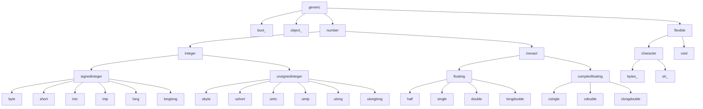

<h1 align="center">
    <a href="https://github.com/jorenham/optype">optype</a>.numpy
</h1>

<p align="center">
    Type aliases & interfaces for
    <a href="https://github.com/numpy/numpy">NumPy</a> scalars, arrays, dtypes,
    and ufuncs.
</p>

## Installation

Optype supports both NumPy 1 and 2.
The current minimum supported version is `1.24`,
following [NEP 29][NEP29] and [SPEC 0][SPEC0].

When using `optype.numpy`, it is recommended to install `optype` with the
`numpy` extra, ensuring version compatibility:

```shell
pip install "optype[numpy]"
```

[NEP29]: https://numpy.org/neps/nep-0029-deprecation_policy.html
[SPEC0]: https://scientific-python.org/specs/spec-0000/

## Example

```python
import numpy as np
import optype.numpy as onp

# TODO
```

## Overview

Just like the `optype` namespace, the `optype.numpy` is *flat*; all you need
is a `import optype.numpy as onp`.

## Reference

For the remainder of these docs, assume that the following import aliases are
available.

```python
from typing import Any, Literal

import numpy as np
import numpy.typing as npt

import optype.numpy as onp
```

Furthermore, for the sake of brevity, `python>=3.13` is assumed, so that
the type parameter syntax ([PEP 695][PEP695]) and the type parameter defaults
([PEP 696][PEP696]) can be used.

### Arrays

#### `Array`

Optype provides the generic `onp.Array` type alias for `np.ndarray`.
It is similar to `npt.NDArray`, but includes two (optional) type parameters;
one that matches the *shape type* (`ND: tuple[int, ...]`),
and one that matches the *scalar type* (`ST: np.generic`).
It is defined as:

```python
type Array[
    ND: tuple[int, ...] = tuple[int, ...],
    ST: np.generic = Any,
] = np.ndarray[ND, np.dtype[ST]]
```

Note that the shape type parameter `ND` matches the type of `np.ndarray.shape`,
and the scalar type parameter `ST` that of `np.ndarray.dtype.type`.

This way. a vector can be typed as `Array[tuple[int]]`, and a $2 \times 2$
matrix of integers as `Array[tuple[Literal[2], Literal[2]], np.integer[Any]]`.

#### `AnyArray`

Something that can be used to construct a numpy array, is often referred to
as an *array-like*, usually annotated with `npt.ArrayLike`.
But there are two main problems with `npt.ArrayLike`:

1. It's name strongly suggests that it *only* applies to arrays. However,
  "0-dimensional" are also included, i.e. "scalars" such as `bool`, and
  `complex`, but also `str`, since numpy considers unicode- and bytestrings
  to be  "scalars".
  So `a: npt.ArrayLike = 'array lie'` is a valid statement.
2. There is no way to narrow the allowed scalar-types, since it's not generic.
   So instances of `bytes` and arrays of `np.object_` are always included.

`AnyArray[ND, ST, PY]` doesn't have these problems through it's (optional)
generic type parameters:

```python
type AnyArray[
    # shape type
    ND: tuple[int, ...] = tuple[int, ...],
    # numpy scalar type
    ST: np.generic = np.generic,
    # python scalar type (note that `complex` includes `bool | int | float`)
    PT: complex | str | bytes = complex | str | bytes,
]
```

> [!NOTE]
> Unlike `npt.ArrayLike`, `onp.AnyArray` does not include the python scalars
> (`PT`) directly.

This makes it possible to correctly annotate e.g. a 1-d arrays-like of floats
as `a: onp.AnyArray[tuple[int], np.floating[Any], float]`.

#### Low-level interfaces

Single-method protocols:

- `__array__`
    ```python
    CanArray[
        ND: tuple[int, ...] = tuple[int, ...],
        ST: np.generic = np.generic,
    ]
    ```
- `__array_function__`
    ```python
    CanArrayFunction[
        F: CanCall[..., Any] = CanCall[..., Any],
        R: object = object,
    ]
    ```
- `__array_finalize__`
    ```python
    CanArrayFinalize[
        T: object = object,
    ]
    ```
- `__array_wrap__`
    ```python
    CanArrayWrap[
        V: Mapping[str, Any] = dict[str, Any],
    ]
    ```

Single-attribute protocols:

- `__array_interface__`
    ```python
    HasArrayInterface[
        V: Mapping[str, Any] = dict[str, Any],
    ]
    ```
- `__array_priority__`
    ```python
    HasArrayPriority
    ```

[PEP695]: https://peps.python.org/pep-0695/
[PEP696]: https://peps.python.org/pep-0696/

### DTypes

### Scalars



#### Boolean

#### Unsigned integers

#### Signed integers

#### Real Floats

#### Complex floats

#### "Flexible" types

#### Other objects
