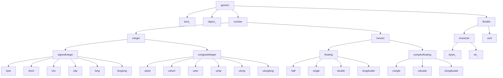

<h1 align="center">
    <a href="https://github.com/jorenham/optype">optype</a>.numpy
</h1>

<p align="center">
    Type aliases & interfaces for
    <a href="https://github.com/numpy/numpy">NumPy</a> scalars, arrays, dtypes,
    and ufuncs.
</p>

## Installation

Optype supports both NumPy 1 and 2.
The current minimum supported version is `1.24`,
following [NEP 29][NEP29] and [SPEC 0][SPEC0].

When using `optype.numpy`, it is recommended to install `optype` with the
`numpy` extra, ensuring version compatibility:

```shell
pip install "optype[numpy]"
```

[NEP29]: https://numpy.org/neps/nep-0029-deprecation_policy.html
[SPEC0]: https://scientific-python.org/specs/spec-0000/

## Example

```python
import optype.numpy as onp

# TODO
```

## Overview

Just like the `optype` namespace, the `optype.numpy` is *flat*; all you need
is a `import optype.numpy as onp`.

## Reference

<!-- TOOD: TOC -->

### Arrays

<!-- TOOD: Array[S: tuple[int, ...], T: np.generic = Any] -->
<!-- TOOD: ArgArray -->

<!-- TOOD: "low-level": CanArray* and HasArray* -->

### DTypes

<!-- TOOD: DType[T: np.generic = Any] -->
<!-- TOOD: ArgDType[T: np.generic = Any] -->
<!-- TOOD: HasDType[DT: np.dtype[Any] = Any] -->

### Scalars

<!-- TOOD: Scalar[T: object, N: int = Any] -->



<!-- TOOD: Any* (top-down: bool, unsigned/signed ints, floats, etc) -->

#### Boolean

#### Unsigned integers

#### Signed integers

#### Real Floats

#### Complex floats

#### "Flexible" types

#### Other objects
